# 🤖 DORE-AI - Your Offline Personal Assistant

<div align="center">
  
</div>

<div align="center">
  
</div>


## 🌟 Overview

**DORE-AI** is a powerful offline personal assistant that combines voice recognition, AI chat capabilities, and system automation. Built with Python and PyQt5, it provides a seamless experience for managing your computer through voice commands and text interactions.

## ✨ Features

- 🎤 **Voice Recognition**: Uses Vosk for offline speech recognition
- 🧠 **AI Chat**: Powered by Ollama with gemma2:2b model
- 🎵 **Music Control**: Play, pause, skip tracks from your music library
- 💻 **System Control**: Adjust volume, brightness, and system settings
- 📁 **File Management**: Create, read, delete files and directories
- 🔍 **Web Search**: Quick Google search functionality  
- ⚡ **App Launcher**: Open browsers, text editors, terminals
- 📊 **System Info**: Monitor CPU, RAM, disk usage, and battery status
- ⏰ **Reminders**: Set and manage personal reminders
- 🎨 **Modern UI**: Floating chat interface with dark theme
- 🔧 **Customizable**: Add your own commands and settings

## 🚀 Quick Start

### Prerequisites

- Python 3.8 or higher
- Windows OS (primary support)
- Microphone for voice input
- Internet connection (for initial setup only)

### 📦 Installation

1. **Clone the repository**
   ```bash
   git clone https://github.com/yourusername/DORE-AI.git
   cd DORE-AI
   ```

2. **Create a virtual environment**
   ```bash
   python -m venv .env
   .env\Scripts\activate  # On Windows
   ```

3. **Install dependencies**
   ```bash
   pip install -r requirements.txt
   ```

4. **Install Ollama**
   - Download from [https://ollama.ai/](https://ollama.ai/)
   - Install and run: `ollama pull gemma2:2b`

5. **Run the application**
   ```bash
   cd Code
   python app.py
   ```

## 🎮 Usage

### Voice Commands
Hold **Left Ctrl** and speak any of these commands:

#### 🔊 Audio Control
- "increase volume" / "decrease volume" / "mute"

#### 💡 Display Control  
- "increase brightness" / "decrease brightness"

#### 🎵 Music Control
- "play music" / "pause music" / "next music" / "previous music"

#### 📁 File Operations
- "create file [filename]" / "read file [filename]" / "delete file [filename]"
- "open file [filename]" / "open directory [path]"

#### 🌐 Applications
- "open browser" / "open text editor" / "open terminal"

#### 📊 System Information
- "system info" / "battery status"

#### 🔍 Web Search
- "search [your query]"

#### ⏰ Reminders
- "remind me [task] [time in minutes]"

#### ⚡ System Control
- "shutdown" / "restart" (use with caution!)

### Chat Interface
- Click the 💬 icon to open the chat window
- Type messages for AI conversations
- Use special commands: `/settings`, `/help`, `/commands`, `/exit`

## ⚙️ Configuration

Access settings through the chat interface:
- Type `/settings` to configure:
  - Username and email
  - Music directory path
  - AI model selection
  - Custom commands

## 🛠️ Project Structure

```
DORE-AI/
├── Code/
│   ├── app.py              # Main application
│   ├── MusicPlayer.py      # Music playback functionality
│   ├── PreDefinedResponse.py # Response handling
│   └── settings.py         # Settings UI
├── Files/
│   ├── settings.json       # User settings
│   ├── user_commands.json  # Custom commands
│   └── *.txt              # Log files
├── models/
│   └── vosk-model-*       # Speech recognition models
└── README.md
```

## 🔧 Dependencies

- **PyQt5**: GUI framework
- **vosk**: Speech recognition
- **ollama**: AI chat capabilities
- **pygame**: Audio playback
- **pyttsx3**: Text-to-speech
- **pyaudio**: Audio input/output
- **psutil**: System information
- **And more...** (see requirements.txt)

## 🤝 Contributing

1. Fork the repository
2. Create a feature branch (`git checkout -b feature/amazing-feature`)
3. Commit your changes (`git commit -m 'Add amazing feature'`)
4. Push to the branch (`git push origin feature/amazing-feature`)
5. Open a Pull Request

## 📝 License

This project is licensed under the MIT License - see the [LICENSE](LICENSE) file for details.

## 👥 Authors

- **Spidey** - *Lead Developer* - [theprosidd@gmail.com](mailto:theprosidd@gmail.com)
- **Drackko** - *Co-Developer* - [saidhin27@gmail.com](mailto:saidhin27@gmail.com)
- **Dhanwanth** - *Contributor* - [dhanwanth.codes@gmail.com](mailto:dhanwanth.codes@gmail.com)

## 🐛 Issues & Support

If you encounter any issues:
1. Check the [Issues](https://github.com/yourusername/DORE-AI/issues) page
2. Create a new issue with detailed information
3. Contact the development team

## 🔮 Future Enhancements

- [ ] Cross-platform support (Linux, macOS)
- [ ] More AI model options
- [ ] Plugin system for extensions
- [ ] Mobile app companion
- [ ] Cloud sync capabilities

## 🙏 Acknowledgments

- Vosk team for offline speech recognition
- Ollama for local AI capabilities
- PyQt5 community for GUI components
- All contributors and testers

---

⭐ **Star this repo if you found it helpful!**

<div align="center">
  
### 📸 **Screenshots**

| 🎤 Voice Interface | 💬 Chat Interface | ⚙️ Settings Panel |
|:---:|:---:|:---:|
|  |  |  |

### 🎯 **Key Features Showcase**

```mermaid
graph TD
    A[🎤 Voice Input] --> B[🧠 AI Processing]
    B --> C[🎵 Music Control]
    B --> D[💻 System Control]
    B --> E[📁 File Operations]
    B --> F[🔍 Web Search]
    B --> G[⏰ Reminders]
    B --> H[💬 Chat Response]
```



</div>
